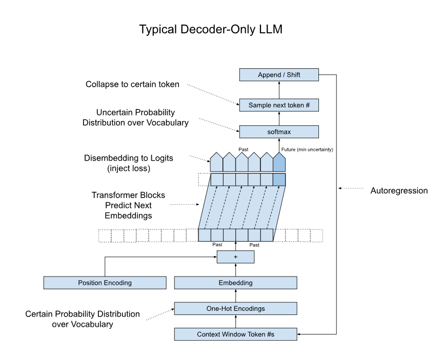
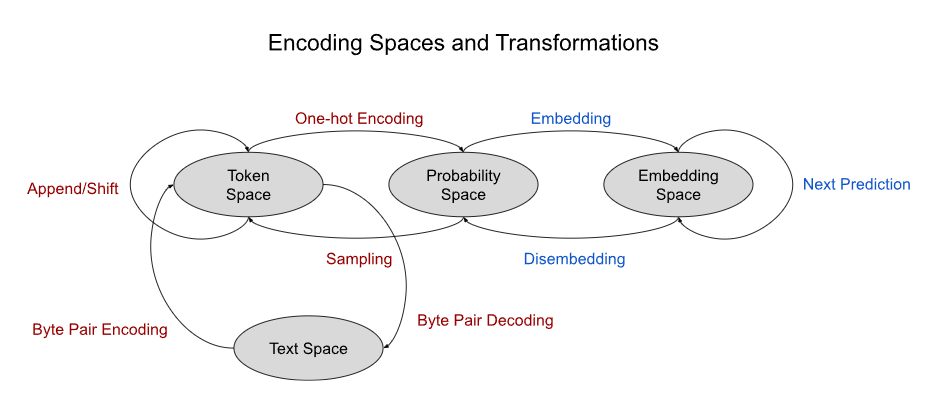
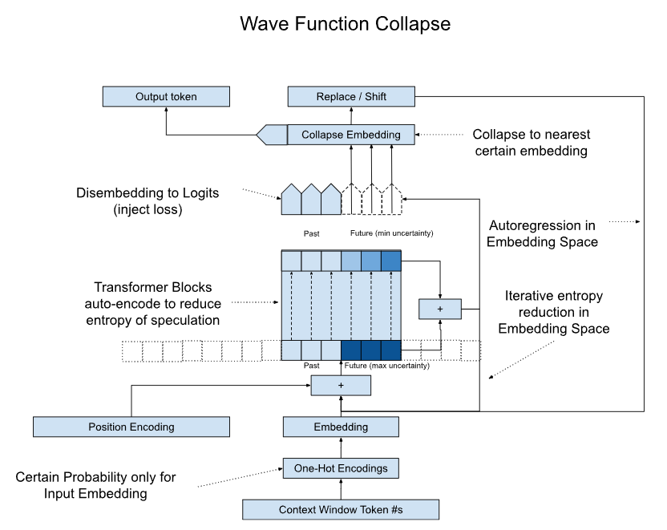
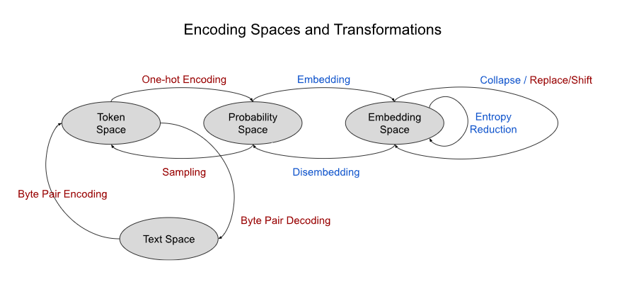
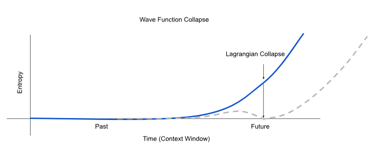

# nanoGPT
This exploration is based on the awesome [nanoGPT](https://github.com/karpathy/nanoGPT) repository. For the original README, see upstream.

# Wave Function Collapse
Wave Function Collapse (WFC) is an idea I have for how to build langauge models using Transformers.  It takes inspiration from a loose analogy to Quantum Mechanics, however it's not required that you understand QM to understand how WFC works. This repository both describes the idea and will attempt to implement/validate small scale models.

The goal of WFC is to be used for generative AI, similar to popular transformer based models such as ChatGPT. The concept isn't specific to text LLMs, however text is a familar and a relatively low cost way to validate it.  

The WFC approach is a bit different from your typical decoder-only LLM in terms of architecture, training, inference, and loss, but it's compatible with the same training sets and makes use of standard Transformer blocks.  

## Understanding Decoder-only LLMs
Before we get into the details of this idea, let's do a quick review of a typical decoder-only LLM model:

I'll assume you're already familiar with LLMs, and just point out a few relevant observations:

- The job of the Transformer blocks is to transform each embedding into the next embedding
  + at training this trains on all content lengths in parallel
  + at inference only the right most disembedding head is used to get the next token
  + embeddings are transfromed from present to next in one go (through several serial blocks)
- The context window (typically much longer than shown), represents the most recent 'past' tokens only
  + there may be additional past tokens that are too far back to fit in the context window
  + as you append/shift you can think of the window as sliding along the timeline to the right
- Autoregression is happening in 'token space'
  + even though the output of the disembedding may be a distribution over our vocab, these nuances are discarded.
  + while this looks horribly inefficient, if you add a KV cache, then most of the work done by the transformer blocks is reused across autoregression steps.

If we zoom out from the details a bit we see that there are 4 'encoding spaces' that represent our input data, as well as several transformations between them:

During inference, we loop through these states in a clockwise fashion
- Starting with text
- This gets tokenized via something like byte pair encoding (for example)
- We one-hot encode the tokens to move into probability space
- We then embed these probabilities to get a sequence of points in embedding space
- The transformer blocks do predition in embedding space
- Then we convert the next embedding to a probability distribution via the disembeding network
- Then we sample this distribution to get to a token
- And finally we decode this token back into text and output to the user

It's important to recognize a few things:

1) The blue transformations are learned, while the other red transformations are simple procedures
2) Each autoregression step, we do a full 'lap' around the various spaces
3) The transformations between spaces are sometimes lossy
4) Each space is convenient for a specific purpose
  * Text Space: useful for human input/output
    - "Hello, my name is Brandon"
  * Token Space: descrete sequence (integers) good for training storage and as a first step towards capturing patterns in the language (common text sequences become single tokens)
    - [0, 212, 43, 9192, 156, 21, 1882, 500]
  * Probabily Space: more expressive than tokens because they can represent both descrete tokens in our vocabulary (one hot encoded) as well as distributions of multiple tokens that can be sampled to pick a descrete token.  However each token is represented by many thousands of dimensions (vocabulary size), so this is more of an intermediate represenatation.
    - []
  * Embedding Space: more compressed and semantically meaningful than Probability Space.  This is where all of the work of the Transformers is done.
    - 
## How might we improve upon this?
First of all, let's set some stakes in the ground.  I don't want to change the 4 spaces above, or make changes to the way Transformers work.  These are too established/proven and I would like to leveraging future research/industry improvements.  

Instead, this idea focuses on making relatively minor changes to the operations between these spaces, guided by some inights gleened from a loose analogy to Quantum Mechanics.  The goal of these changes is to end up with a system that is similar to above, only better in terms of accuracy, compute, memory, scalability, and/or reasoning & planning.

Before I get into the details of the analogy let's look at some things in the model above that we could possibly improve upon:

1. The Transformer Blocks are trying to transform from an embedding to the next embedding using many sequential Blocks with independent weights (perhaps refinement between layers).
    - rather than via an interative refinement process in embedding space (like an ODE).
    - this means it's the same cost no matter how complex the problem is.  
    - "Birds of a feather flock..." takes just as much compute as "When I opened the old book, I discovered..."
1. The autoregression is done in token space, requiring multiple lossy transformations
    - if we were able to auto-regress in embedding space, we may be able to preserve more nuance
    - consider that multiple points in embedding space can map to the same probability distribution and that different probability distributions can be sampled resulting in the same token.
    - the conversion to/from tokens is akin to quantizing the whole embedding 'volume' down to just the N points within the volume that correspond to tokens in the vocabulary. 
1. It's just spitting out the first thing that comes to mind, with no 'thinking ahead'.
    - Speculating multiple future tokens is expensive in this model because of the buterfly effect.
    - This limits our opporunity for reasoning (stearing towards preferred futures)
    - If we could speculate even with low confidence, it could potentially improve accuracy.

## Understanding Wave Function Collapse
Now let's take a look at the diagram for Wave Function Collapse, and then I'll discuss how it incorporates these opportunities, and I'll explain some of the insights that led to it.

It starts out identical to a standard decoder LLM, however the Transformer is a bit different.
1. The input embeddings are divided into two segments.
    - The "Past" segement represents embeddings that have already been input/output by/to the users.
    - The "Future" segment represents a linear sequence (not tree) of speculated future embeddings.
      + Initialized to embedding from a max-entropy probability distribution (anything is possible)
    - Note that we aren't speculating auto-regressively. The speculation is computed in parallel.
1. Rather than the Transformer Blocks predicting the next token, they are simply auto-encoding
    - Like an encoder-style Masked Language Model (MLM), only we're going to generate text autoregressively from it.
    - It learns to minimize the entropy (uncertainty) in the input tokens
    - It shouldn't collapse because it's trained on the zero-entropy one-hot encodings rather than explicitly minimizing loss
    - The output is the same as input for past tokens, but for future tokens it squeezes as much entropy out as it can, giving a sequence that represents the probability distributions of the future timesteps.
1. We don't have to use a causal mask, however it is compatible with one to limit speculation distance.
    - it is desirable that past and future embeddings attend to each other, we can alway pad with more future embeddings
    - it is expected that the entropy of the future embeddings will grow the further you speculate
        - this 'butterfly effect' is reflected in the uncertainty
    - tbd, if it's better to 'pin' past tokens to their zero-entropy output vs. allowing the past to drift (be recontextualized) as future embeddings collapse.
1. Transformer Blocks are actually computing a velocity, which gets added back to the input iteratively
    - Similar to an iterative physics solver
    - This isn't a core part of the idea, however since we switched to an entropy-minimizing autoencoder, it means it's easy for an iterative solver to detect when it's converged (zero velocity/change) and early exit.  Now the cost can be proportional to the complexity of the problem.

The outputs of the Transformer Blocks are initially handled similar to the decoder-LLM, during training loss in injected into each output via the disembedding projection, during inference things are a little different.

1. Rather than immediately projecting into Probability Space, we want to "collapse" one or more uncertain future embeddings into a certain (zero-entropy) embedding.
    - This allows us to autoregress in embedding space
    - The collapse of uncertainty about the future is how the past is minted in this system.  The collapsed embedding becomes part of the past segment in the context for the next autoregressive step.
    - I'll explain more of the details of this block after the analogy below.
1. We then convert this collapsed embedding into a token that can be output as text
    - This is only for the benifit of a human user, the output token/text is not used by the system
1. The collapsed embedding replaces the uncertain embedding
    - Then we continue reducing entropy like before and the rest of the context will respond to this collapse sort of like a vibration in a string
    - Autoregression is basically the same 'loop' we only take a slight detour to collapse, output, replace
    - Note that we're NOT starting from scratch each time we autoregress, the whole context window,including the speculated future tokens are already nearly-converged with minimal entropy, and that carries over to the next cycle losslessly.
1. We don't have to collapse JUST the first future embedding
    - we can explore strategies like collapsing embeddings below some entropy threshold
    - we can even collapse (or partially collapse) future embeddings non-causally. The other embeddings will adjust to fill in the gaps.
    - by continually partually-collaping the median-entropy embedding we may be able to 'draw out' the speculation horizon to some likely distant future as far into the future as needed for reasoning.
    - Note that we don't collapse all of the future tokens in one go, that would produce mostly gibberish because of the inherent uncertainty, however that doesn't mean these embeddings aren't contributing useful information to the more-present embeddings

The encoding spaces remain the same, only we can see the autorecursion is done in embedding space via "Collapse" and the "Next Prediction" is replaced with "Entropy Reduction" (still a Transformer).

## Quantum Mechanics Analogy

The analogy here isn't meant to be too literal, but I find it useful to explicitly state correspondances because doing so often leads to new ideas/insights.

| LLM Concept                    | Quantum Mechanics Concept     |  Why? |
|--------------------------------|-------------------------------|--------
| Token                          | Quantum State                 | Descrete values that can be observed
| Logits / Probs                 | Superposition of States       | Uncertainty between one or more states
| Embedding / Context Window     | Wave Function                 | How the uncertainty is encoded
| Sampling                       | Measurement / Collapse        | The transition from uncertain -> certain mints
| Attention                      | Entanglement / Coherence      | Interdependencies between multiple particles
| Softmax                        | Uncertainty Principle         | The more certain you are of one state, the less you are of another
| Context Window                 | Spacetime                     | Context can represent temporal (think text) of spatial (think image patches) sequences of embeddings
| Speculation Tree               | Many Worlds Interpretation    | As you speculate out in to the future, the number of possible future timelines expands rapidly

From this, you can see why I call this idea 'Wave Function Collapse', the goal of the network is to minimize the entropy in the full spacetime wavefunction.  The future embeddings represent a ensemble probability distribution over all possible futures at each layer of a specualation tree.  Once this has converged, we can advance time by taking a 'measurement' of one of the next embedding, which collapses it from a superposition of possible states into a specific state (token).  Since all of the embeddings are entangled via attention, the next embedding collapse will cause changes to the remainder of the context/wave function (possibly non-causally), which pushes the uncertanty to the right (when we shift the context left, we fill in max-entropy embeddings on the right).

If you were to graph the entropy (uncertainty) of the context window, then the past segment on the left side of the context would be near zero entropy, and the future segement would ramp up towards the maximum entropy.

This is also true for a decoder-only LLM, however they typically only predict the next embedding (one in the future) at a time, so the entropy often doesn't get very high.

Notice that we're giving up some of the context window for the speculated future, however doing so may help with the accuracy of the next token (it has some think-ahead information to attend to).  In practice the future embeddings  would probably be a small fraction of the context, and most of the time the context isn't full anyways.  In either case, the number of future embeddings can be dynamically handled based on the shape of the entropy curve.  In the case where it's only 1 embedding, the graphs above would both look like the Decoder-Only LLM.

When we collapse a future embedding, we're sort of forcing a point on this graph down to zero.  The rest of the graph then re-converges to minimal entropy, which will have the effect of pushing the uncertainty 'hockey stick' over to the right (future).  I think of this like squeezing toothpaste out of a tube, or the wave of time moving into the future.

In quantum mechanics, there is a concept call Legrangian Mechanics that relates to the principle of least action.  Reversing the analogy can lead to new ideas related to the LLM idea.  For example, what if instead of collapsing the next token, we use some policy model to collapse something in the middle of the future segment?  The entropy-minimizing transformer would converge towards a state that tries to fill in the tokens to get you to this state.  This could allow for a more efficient binary search over possible futures to help with reasoning.

This leads to another idea of only partially collapsing some future token.  You could imagine several iterations of holding a partial collapse followed by converging on a new minimal entropy.  This could be a way to extend out the time horizon for speculation for some plausable future.